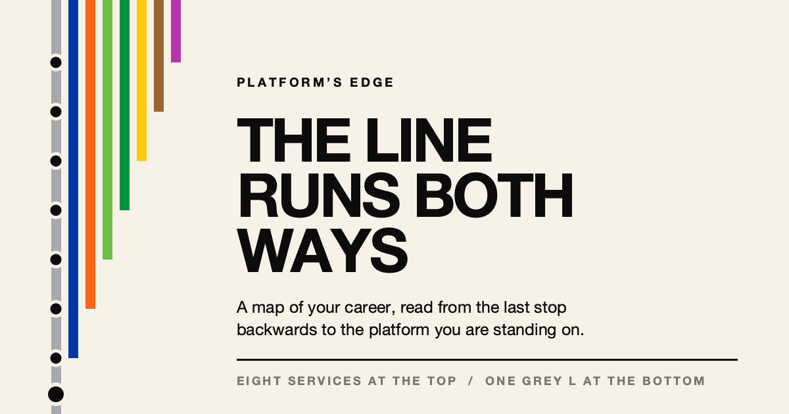

# The Line Runs Both Ways

**[Read it here](https://feldtdesign-ship-it.github.io/Milestones1/)**

A map of PJ O'Rourke II's career, read from the last stop backwards to the platform he is standing on.

Eight coloured services run at the top of the page. One ends at every stop going down, because that is the year it had not started yet. By the bottom there is a single grey L, and a man with a cart.

Built from `build_line.py`. Editing a stop is a data change, not an HTML hunt.

Platform's Edge / Feldt Design
